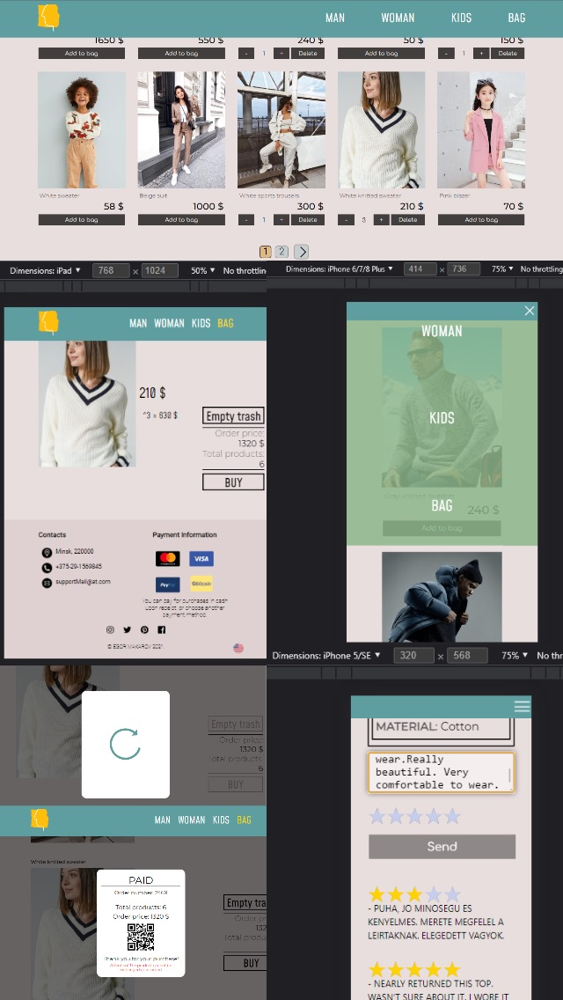

# online-store

This project was bootstrapped with [Create React App](https://github.com/facebook/create-react-app) and [REDUX liblary](#appendix).



### _Try it: [online-store](https://makegor.github.io/online-store/)_

## The author of the project: __Egor Makarov__

way of communication | contacts
:---|---:
_mail_| __makegor981@outlook.com__
_github_| __https://github.com/makegor__

# Building the repository and running it locally

### `$ git clone "SSH adress"`
Copying the repository from GitHub

### `npm start`

Runs the app in the development mode.\
Open [http://localhost:3000](http://localhost:3000) to view it in the browser.

The page will reload if you make edits.\
You will also see any lint errors in the console.

### `npm run test`

Launches the test runner in the interactive watch mode.\
See the section about [running tests](https://facebook.github.io/create-react-app/docs/running-tests) for more information.

### `npm run deploy`

```
"scripts": {
    ...
    "deploy": "gh-pages -d build",
    "predeploy": "npm run build"
  },
```

Builds the app for production to the `build` folder.\
It correctly bundles React in production mode and optimizes the build for the best performance.

The build is minified and the filenames include the hashes.\
Your app is ready to be deployed!

See the section about [deployment](https://facebook.github.io/create-react-app/docs/deployment) for more information.

### `$ git log`

Version selection:
1) Earlier versions - press enter.
2) Upgrade to an earlier version. to find out the commit-number enter: `$ git chekout commit-number`

# Appendix

### __[REDUX liblary](https://redux.js.org/) :__
```
import { applyMiddleware, combineReducers, createStore } from "redux";
import thunkMiddlewere from "redux-thunk";
import { reducer as formReducer } from "redux-form";

import contentReducer from "./content-reducer";
import productReducer from "./product-reducer";
import basketReducer from "./basket-reducer";
import authReducer from "./auth-reducer";

let reducers = combineReducers({
    Content: contentReducer,
    Product: productReducer,
    Basket: basketReducer,
    auth: authReducer,
    form: formReducer
})

let store = createStore(reducers, applyMiddleware(thunkMiddlewere));

export default store;
```